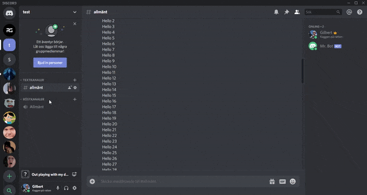

# Discord Music Bot

## Table of Contents

* [About the Project](#about-the-project)
* [Getting Started](#getting-started)
  * [Prerequisites](#prerequisites)
  * [Installation](#installation)
* [Host the bot](#host-the-bot)
* [Contact](#contact)

## About the project

Want to play rickroll when your friends join your discord channel? This is a simple discord bot that plays music when a specific user joins the channel. The project also contains the necessary files for hosting the bot with node.js to keep it online at all hours.\


## Getting started

### Prerequisites

* node.js
[https://nodejs.org/en/](https://nodejs.org/en/) Note: You need node.js version 10.0.0 or newer
* ytdl-core
```sh
npm install ytdl-core
```
* FFMPEG
```sh
npm install ffmpeg
```
* FFMPEG binaries
```sh
npm install ffmpeg-binaries@3.2.2-3
```
* Opus engine
```sh
npm install node-opus
```
* Discord.js
```sh
npm install discordjs/discord.js
```

### Installation

1. Create an account or log in on [https://discordapp.com/developers/applications/](https://discordapp.com/developers/applications/)
2. Create a new application on the website
3. Get your authorization token
    1. Go to "Bot" section in the setting to the left on the site
    2. Copy the token
4. Send bot to server
    1. Find client id in the "General Information" section
    2. Swap your client id with the CLIENTID in the link [https://discordapp.com/oauth2/authorize?&client_id=CLIENTID&scope=bot&permissions=8](https://discordapp.com/oauth2/authorize?&client_id=CLIENTID&scope=bot&permissions=8)
    3. The bot should now show in your channel
5. Clone the repository
6. Add the discord token to your 'auth.json' and 'bot.js'
```sh
"token": "AUTH TOKEN HERE"
```
```sh
bot.login('Add Login here')
```
7. Change the variable in 'bot.js' to the user's id when the music is going to play. You can also create other cases with other user id:s. To get your or your friends id simply right click on a user and click "Copy ID".
```sh
case 'User ID Here':
```
8. Change the variable in 'bot.js' to the location where the music file is located
```sh
playFile('Location for music file', newMember);
```
9. Run the bot with the command
```sh
node bot.js
```

## Host the bot

I've personally hosted my discord bot on [https://www.heroku.com/](https://www.heroku.com/) which works good most of the time and is 100% free, however, it is not recommend by discord developers since it doesn't work too good with the opus engine\
The files required for the host already exists.
1. Create a project on heroku
2. Add buildpacks
    1. Go to settings -> buildpacks and add the following buildpacks
    2. heroku/nodejs
    3. https://github.com/dubsmash/heroku-buildpack-opus.git
    4. https://github.com/jonathanong/heroku-buildpack-ffmpeg-latest
3. Push your code to the project
4. Under resources in your project make sure that "worker" is enabled
5. The bot should now work

## Contact

Tobias Mellberg - Tobbemellberg@hotmail.se
